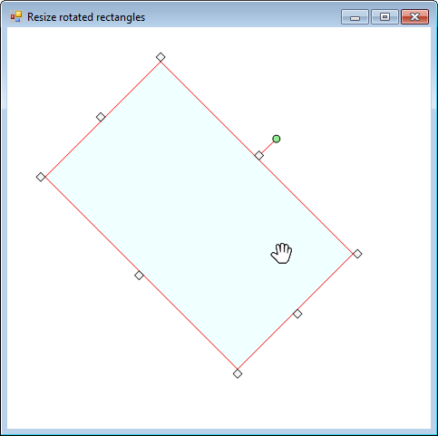

# Resize and Rotate Shapes in GDI+

A mouse-driven shape editor for VB.NET / WinForms that implements **anchors** to
move, resize and rotate a selection rectangle — including the awkward case of
resizing a rectangle that is *already rotated*.

> Originally published on CodeProject as
> [Resize and Rotate Shapes in GDI+](https://www.codeproject.com/Tips/1223125/Resize-and-Rotate-Shapes-in-GDIplus)
> by Andy De Filippo.



## Introduction

The code implements a mouse-driven shape editor that supports moving, resizing
and rotating a selection rectangle via anchors, which may be used to outline any
type of contents, such as images, shapes, text and so on.

## Background

Drawing rotated elements in GDI+ is a fairly simple task. Creating a resizing
mechanism via mouse movements is also rather simple. A few problems may arise
when you try to **resize a rotated element**, due to the way GDI+ enables you to
rotate a shape around a given point (usually the center).

After many days of frustrated Googling, I came up with this solution that I'm
sharing here in the hope that it might help you save time.

## Using the code

The form's `mouse_` events show how to handle mouse movements and how to detect
the type of operation being executed (`move`, `resize`, `rotate`).

All drawing takes place in the `Render` method, which is also responsible for
storing the regions used in the mouse events to detect where and how the mouse
is being used.

When dealing with a rotated object, mouse hit testing needs to be done via
**regions** (or paths) so that the cursor location can be properly linked to the
elements on screen.

During the rendering of a rotated element being resized, **the key is to select
the proper center origin to rotate around**, which is the center of the rectangle
as it was the last time it was rendered before resizing started.

```vbnet
' Define center origin
Dim ptCenter As PointF = _
      New PointF(_rcRect.Left + (_rcRect.Width / 2), _rcRect.Top + (_rcRect.Height / 2))

' Check for on-going resize operation
Select Case _eMouseOperation
    Case MouseOperation.Nwse To MouseOperation.We
        ' Use last known center origin
        ptCenter = _ptCenter
    Case Else
        _ptCenter = ptCenter
End Select
```

Also, right after rendering a rotated element, you need to compute the position
of the rectangle as it would be if it were flat, calculated around the new center
origin. This will be the new rectangle to be used after the resize operation is
over.

```vbnet
' Check for rotation
If (_rgRect IsNot Nothing) AndAlso (_snAngle <> 0.0) Then

    ' Get rotated rectangle bounds
    Dim rfNewBounds As RectangleF = _rgRect.GetBounds(oGfx)

    ' Check for resize operation on a rotated element
    If (_eMouseOperation >= MouseOperation.Nwse) AndAlso _eMouseOperation <= MouseOperation.We Then

        ' Get center origin of the region
        Dim ptNewScreenCenterOrigin As New PointF _
          (rfNewBounds.Left + (rfNewBounds.Width / 2), rfNewBounds.Top + (rfNewBounds.Height / 2))

        ' Compute a rectangle based on source rectangle size and located around the center point
        ' of the bounds of the rotated region
        Dim rcNewRenderRect As New RectangleF((ptNewScreenCenterOrigin.X - (_rcRect.Width / 2)), _
                                              (ptNewScreenCenterOrigin.Y - (_rcRect.Height / 2)), _
                                              _rcRect.Width, _
                                              _rcRect.Height)

        ' Store for mouse up
        _rcResizeMouseUpRenderRect = rcNewRenderRect

    End If

End If
```

## Points of interest

The method `AnchorToCursor` returns the most suitable cursor when the mouse is
hovering over one of the anchors. The selection is processed taking into account
the anchor type (cardinal point) and the current rotation angle. As it turns out,
rendering a custom rotated arrow cursor can lead to bad results, so it's best to
always use one of the factory arrows, even if the angle doesn't precisely match
that of the rotation/cardinal point. The Microsoft Office shape editor uses the
same approach.

## Building

| | |
|---|---|
| Language | VB.NET |
| UI | Windows Forms |
| Target framework | .NET Framework 3.5 |
| Solution | `ResizeRotated.sln` |

Open `ResizeRotated.sln` in Visual Studio and build. The project targets .NET
Framework 3.5; if that targeting pack is not installed, retarget the project to a
newer .NET Framework version — the code has no dependency on 3.5-specific APIs.

### Layout

```
FrmMain.vb              Main form: mouse handling, Render, AnchorToCursor
FrmMain.Designer.vb     Designer-generated form code
FrmMain.resx            Form resources
My Project/             VB.NET application, settings and resource plumbing
Resources/              hand_open.ico and rotate.cur mouse cursors
```

## History

* First version submitted on December 30<sup>th</sup>, 2017
* Bug fix submitted on December 9<sup>th</sup>, 2021

## License

Licensed under [The Code Project Open License (CPOL) 1.02](LICENSE).
